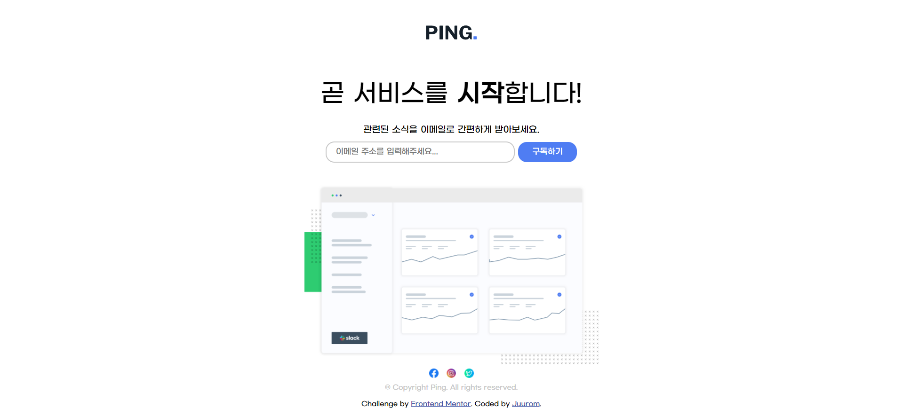
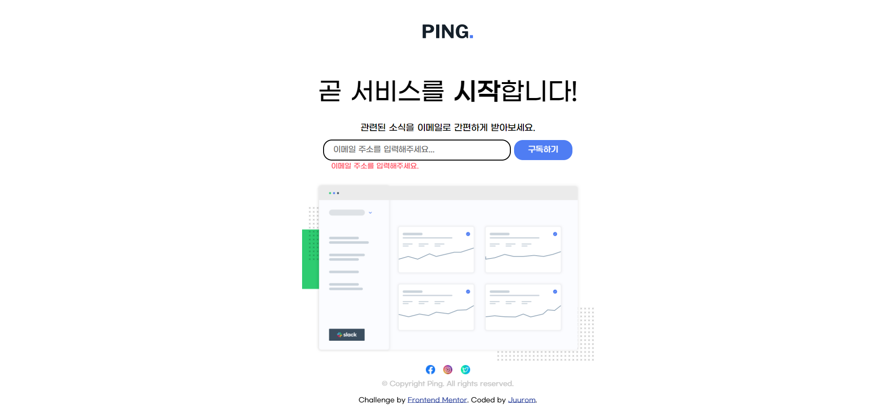
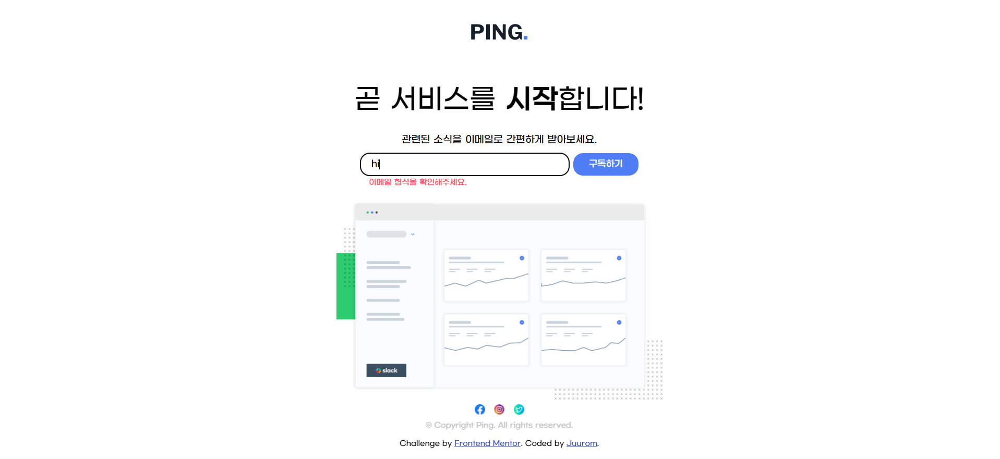
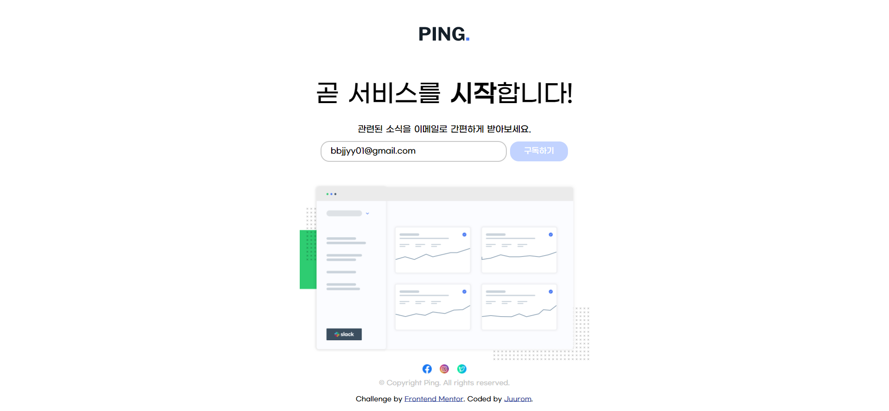

# Frontend Mentor - Interactive rating component solution

이 솔루션은 [Interactive rating component challenge on Frontend Mentor][Ping coming soon page challenge on Frontend Mentor](https://www.frontendmentor.io/challenges/ping-single-column-coming-soon-page-5cadd051fec04111f7b848da) 챌린지 참여 결과물입니다.

## 차례

- [소개](#소개)
  - [챌린지](#챌린지)
  - [화면 스크린샷](#화면-스크린샷)
  - [링크](#링크)
- [배운 점](#배운-점)
  - [사용 tool](#사용-tool)
  - [새롭게 배운 것](#새롭게-배운-것)
  - [앞으로 배울 것](#앞으로-배울-것)
  - [참고 사이트](#참고-사이트)
- [제작자](#제작자)
- [기타사항](#기타사항)

## 소개

### 챌린지

PING이라는 가상의 페이지의 새소식을 구독할 수 있도록
이메일을 입력하여 구독받는 페이지를 만들었다.
공백이 입력되거나, 잘못된 이메일 형식이 입력되면
에러 메시지를 출력하도록 했다.
올바른 이메일 형식이 입력되면
JS 변수로 저장해 Console.log로 보여주도록 했다.

### 화면-스크린샷







### 링크

- Solution URL: [Github](https://github.com/juurom/Notify___frontendMentor/)
- Live Site URL: [Live Site](https://juurom.github.io/Notify___frontendMentor/)

## 배운-점

### 사용-tool

- HTML
- CSS
- JAVASCRIPT (Jquery)

### 새롭게-배운-것

1. css flexbox
div를 가로로 정렬하는 방법을 찾아보다가, flex를 선택하였다.
화면 하단 작은 아이콘을 dispaly:flex 로 구현했다.
그리고 flex item에 해당하는 div의 width를 각각 30px로 주어서
일정 거리 이상 떨어져 있을 수 있게 만들었다.

flex에 관한 개념... 한번 싹 정리해야겠다.
아래 블로그에 좋은 설명이 있어 링크를 가져왔다.
https://studiomeal.com/archives/197

CSS
```css
#social{
    display:flex;
    justify-content: center;
}

#icon{
    width:30px;
}
```

2. 이미지 클릭 시 다른 링크로 리디렉션
이미지 태그와 a 태그를 함께 쓰면 된다.
a 태그 안에 이미지 태그를 넣어서, 이미지를 하이퍼링크로 썼다.

HTML
```html
  <div id="social">

    <div id="icon">
      <div id="facebook">
      <a  href="https://www.facebook.com/">
        </a>
      </div>
    </div>
      <div id="icon">
        <div id="instagram">
      <a  href="https://www.instagram.com/">
      </a>
      </div>
    </div>
    <div id="icon">
      <div id="twitter">
      <a  href="https://twitter.com/">
        </a>
    </div>
  </div>

  </div>
```

3. 이메일 유효성 검사

이메일 유효성 검사를 위해서 입력값을 정규식과 비교한다.
이메일이 공백일 경우와, 이메일 형식이 올바르지 않을 경우 에러 메시지를 띄우기 위해
에러를 넣을 div의 class에 hidden을 없애 주고 에러 메시지를 보이게 했다.
"text area"라는 텍스트를 넣은 이유는,
css에서 visibility:hidden을 해주어도 텍스트가 없으면 div이 차지하는 공간이 없어져서
한 줄짜리 디폴트 텍스트를 넣고 보이지 않게만 처리해 주었다.

이메일 유효성 검사 정규식은 아래 블로그를 참고했다.
https://webisfree.com/2016-05-12/%EC%9D%B4%EB%A9%94%EC%9D%BC-%EC%A3%BC%EC%86%8C-%EA%B2%80%EC%A6%9D-%EC%8A%A4%ED%81%AC%EB%A6%BD%ED%8A%B8-%EC%A0%95%EA%B7%9C%ED%91%9C%ED%98%84%EC%8B%9D

HTML
```html
<form id="email">
  <input id="userinput" type="text" placeholder="이메일 주소를 입력해주세요..."/>
  <button id="submit">
    구독하기
  </button>
  <div id="error" class="hidden">text area</div>
</form>
```

CSS
```css
.hidden{
    visibility: hidden;
}
#error{
    font-size: 12px;
    color:hsl(354, 100%, 66%);
    margin-right:250px;
}

```

JS
```javascript
$("#submit").click(function(event){
    event.preventDefault();
    var email=$("#userinput").val();
    /*input box 안의 값*/

    var useremail="";
    /*입력받은 옳은 이메일*/

    var regExp= /^[-!#$%&'*+./0-9=?A-Z^_a-z{|}~]+@[-!#$%&'*+/0-9=?A-Z^_a-z{|}~]+.[-!#$%&'*+./0-9=?A-Z^_a-z{|}~]+$/;
    /*이메일 유효성 검사 정규식*/

    if(email==""){/*공백일 경우*/
        $("#error").removeClass("hidden");
        $("#error").text("이메일 주소를 입력해주세요.");
    }
    else{
        if(!regExp.test(email)){
            $("#error").removeClass("hidden");
            $("#error").text("이메일 형식을 확인해주세요.");
        }
        else {
            $("#error").addClass("hidden");
            $("#error").text("text area");
            useremail=email;
            console.log(useremail);
        }
    }
});
```

4. 엔터로 form submit

습관적으로 엔터로 입력을 마무리해서
엔터키로 submit 버튼을 누른 것과 같이 작동하도록 했다.

JS에서는
object.addEventListener('keypress', function(key)
로 하면 된다.
jquery에서는
object.on("keyup", function(key)
로 하면 된다.

아래는 jquery를 사용한 코드이다.

JS
```javascript
$("#userinput").on("keyup", function(key){
    if(key.key=='Enter'){
        $("#submit").click();
    }
})
```

5. 가운데 정렬

text-align: center을 통해서 쉽게 할 수 있다.
안 될 때 margin-left:auto; margin-right:auto;를 사용한다.

```css
body{
    font-family: 'GmarketSansMedium', sans-serif;
    text-align: center;
}

#illustration{
    margin-top:20px;
    width:500px;
    display:block;
    margin-left:auto;
    margin-right:auto;
}
```

### 앞으로-배울-것

위 링크 걸어둔 블로그에서 css flex 개념을 정리해야 할 것 같다.
자바스크립트 관련 프로젝트를 계속 진행해 볼 것이다. 

form으로 입력받은 이메일을 어떻게 내부적으로 처리하는지 궁금하다.
이것도 한 번 찾아보아야겠다.

### 참고-사이트

- [css flex 개념](https://studiomeal.com/archives/197) - flex 외에도 다양한 개념이 잘 정리되어 있는 것 같다.

## 제작자

- Github - [@juurom](https://github.com/juurom/)
- Frontend Mentor - [@yourusername](https://www.frontendmentor.io/profile/juurom)

## 기타사항
재밌다! 그런데 아직 페이지가 휑한 느낌이 든다.
얼른 많이 공부해서 꽉 찬 페이지들을 만들어 보고 싶다.